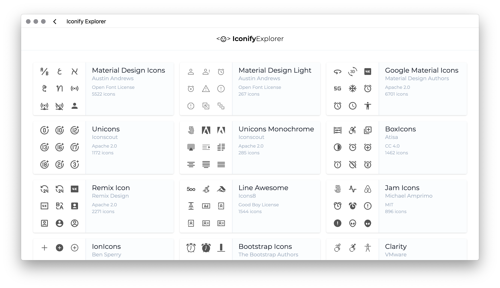
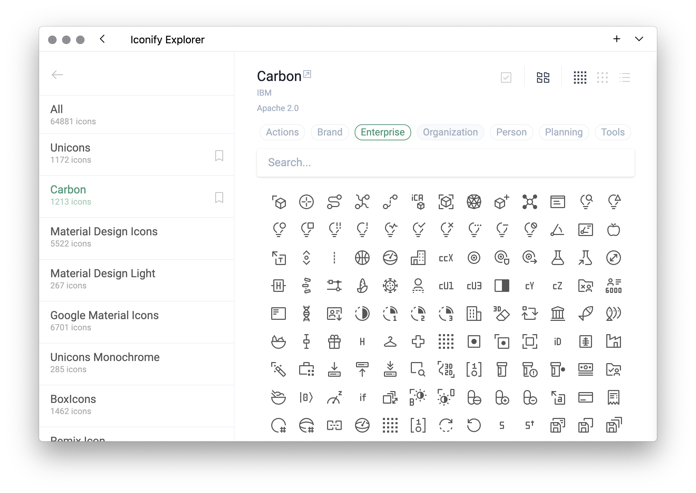
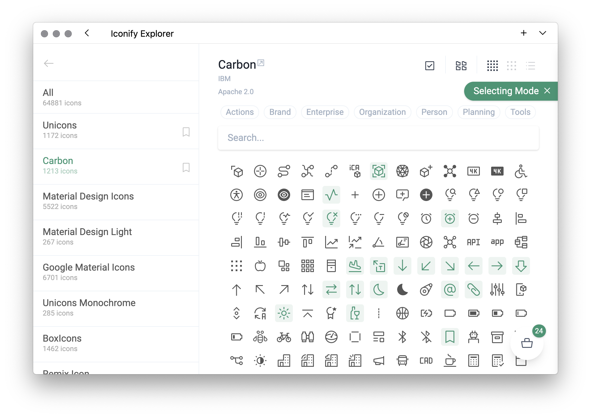
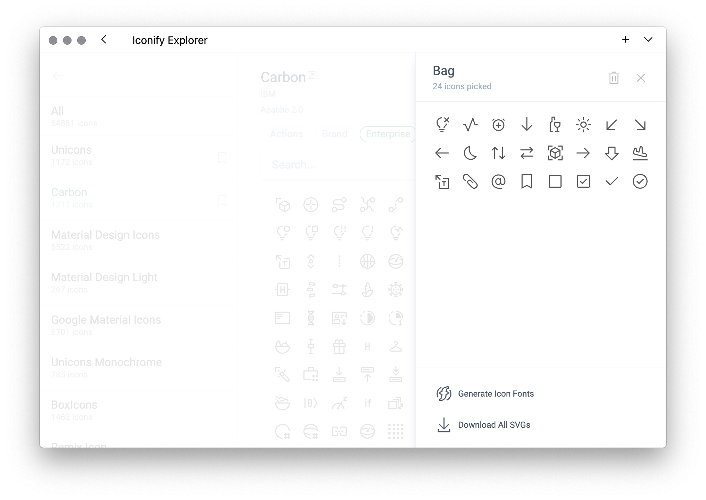
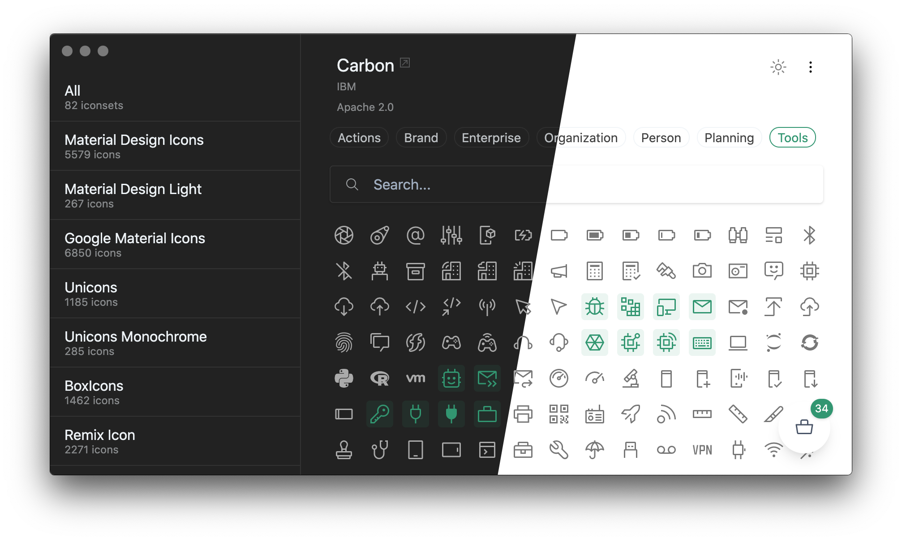

<h1 align="center">
Icônes
</h1>

Icon Explorer with <b>Instant</b> searching, powered by <a href="https://github.com/iconify/iconify" target="_blank">Iconify</a> 

<a href="https://icones.js.org">Go to App</a>

<em>Electron is coming...</em>

<em>Dark Mode is now Live!</em>

  

### Features

- **Instant Fuzzy Searching** _- all are done locally, no web queries!_
- The **Bag** _- select your icons and pack them into a ready-to-use icon font!_
  - _[svg-packer](https://github.com/antfu/svg-packer) was born from this XD_
- Copy the usage scripts
- SVGs direct download
- Mobile friendly
- Collection bookmarks
- Categories filters
- Dark mode
- Built with [Vite](https://github.com/vitejs/vite) and Vue 3
  - If you like how it's built - try [🏕 Vitesse](https://github.com/antfu/vitesse), an opinionated starter template made from Icônes

### Community

- [VS Code Extension](https://github.com/afzalsayed96/vscode-icones) by [@afzalsayed96](https://github.com/afzalsayed96)

### TODOs

- Electron client (Coming!)
- Full-offline mode - pack all the icons

## License

MIT - Anthony Fu 2020
